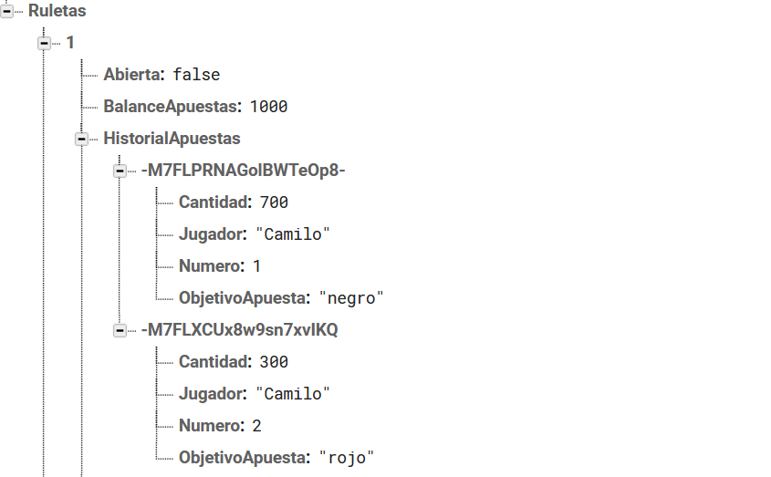

# Ruleta API
Api que permite crear, abrir, cerrar, apostar y obtener ruletas desarrollado en ASP.NET core 3.1.
Se utiliza una base de datos en tiempo real proporcionada por Firebase, organizada en forma de árbol JSON. El servicio proporciona a los desarrolladores de aplicaciones una API que permite que la información de las aplicaciones sea sincronizada y almacenada en la nube de Firebase.
Permite la escalabilidad y fácil administracción de los datos.

